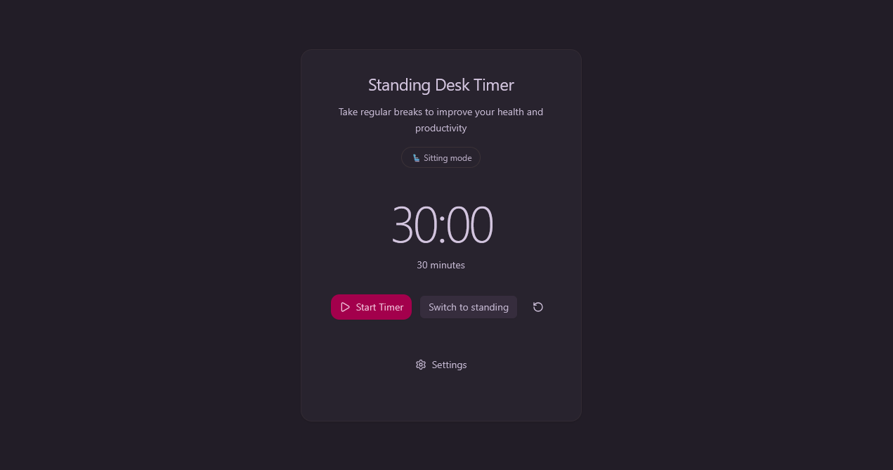

# StandUp - Standing Desk Timer



Minimal, elegant timer to remind you to stand after long sitting periods, plus a standing stopwatch. Built with React, TypeScript, Vite, Tailwind v4, and shadcn/ui.

## Features

- Sitting countdown with presets (15/30/45/60 minutes)
- Standing mode as an infinite stopwatch (00:00 → …)
- Auto-switch to standing on completion, with a clean alert and optional voice notification
- Single-click mode toggle next to Start/Pause
- Minimal, centered UI with theme toggle and accessible controls
- Settings as a dialog (voice on/off, voice selection, duration)
- PWA-ready icons and manifest

## Quick start

```bash
pnpm install
pnpm dev
```

## Build

```bash
pnpm build
pnpm preview
```

## Configuration

- Title and icons are defined in `index.html`
- PWA manifest generated in `dist/manifest.webmanifest`
- Main timer UI in `src/components/StandingDeskTimer.tsx`
- Hooks: `src/hooks/useTimer.ts` (countdown), `src/hooks/useStopwatch.ts` (standing)

## Accessibility

- Settings dialog uses proper roles/labels (`aria-*`) and keyboard focus
- Controls include labels and semantic variants

## License

MIT © 2025 StandUp Contributors
